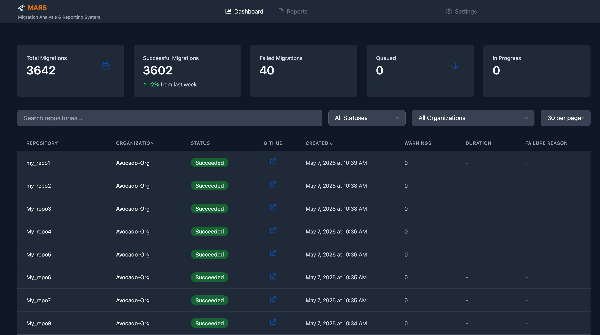

# GitHub Repository Migrations Tracker

A modern, full-stack application to monitor and track GitHub Repository Migrations using GitHub GraphQL API. This application allows you to sync, track, and visualize repository migration information across your GitHub Enterprise organization.



## Features

- 📊 Track migration status for all repositories in your GitHub organization
- 📝 Store migration data for historical reference and analysis
- 🔄 Sync migrations from GitHub API with a personal access token
- 📈 View statistics about migration success rates and status
- 📱 Modern, responsive UI built with React and Tailwind CSS

## Tech Stack

- **Frontend**: React, TypeScript, Tailwind CSS, Apollo Client, Chart.js
- **Backend**: Node.js, Express, GraphQL (Apollo Server)
- **Database**: MongoDB
- **Development**: Docker, Docker Compose
- **Build Tools**: Vite, TypeScript

## Prerequisites

- [Docker and Docker Compose](https://docs.docker.com/get-docker/)
- [Node.js](https://nodejs.org/) v18 or higher (for local development)
- [GitHub Personal Access Token](https://docs.github.com/en/authentication/keeping-your-account-and-data-secure/creating-a-personal-access-token) with:
  - `repo` scope (for repository access)
  - `read:org` scope (for organization access)
  - `read:enterprise` scope (for enterprise access)
  - `admin:org` scope (required for managing migrator role)
  
### Required Permissions

For the migration tracking to work properly, you need one of the following:

1. Be an organization owner
2. Have the migrator role assigned to you or your team

If you're not an organization owner, you'll need to have someone grant you the migrator role. This can be done in two ways:

#### Using GitHub CLI with GEI extension

```bash
# Install the GEI extension first
gh extension install github/gh-gei

# Grant migrator role (must be done by an organization owner)
gh gei grant-migrator-role --github-org YOUR_ORG --actor YOUR_USERNAME --actor-type USER
```

#### Using GraphQL API

Organization owners can grant the migrator role using the `grantMigratorRole` mutation through the GraphQL API.

⚠️ **Important Notes:**
- The migrator role grants access to import/export any repository in the organization
- You must be granted the migrator role separately for each organization
- You cannot grant the migrator role for enterprise accounts
- Personal Access Tokens (classic) are required - fine-grained tokens are not supported
- If your organization uses SAML SSO, you must authorize your PAT for SSO access

For more details, see the [GitHub Enterprise Importer documentation](https://docs.github.com/en/migrations/using-github-enterprise-importer/migrating-between-github-products/managing-access-for-a-migration-between-github-products#granting-the-migrator-role-with-the-gei-extension).

## Getting Started

### Using Docker (Recommended)

1. **Clone the repository**

```bash
git clone https://github.com/yourusername/GHEC-Migrations-tracker.git
cd GHEC-Migrations-tracker
```

2. **Start the application with Docker Compose**

```bash
docker-compose up
```

This will start:
- MongoDB database at port 27017
- Backend API server at http://localhost:4000
- Frontend client at http://localhost:3000

3. **Access the application**

Open your browser and navigate to http://localhost:3000

### Local Development (Without Docker)

1. **Clone the repository**

```bash
git clone https://github.com/yourusername/GHEC-Migrations-tracker.git
cd GHEC-Migrations-tracker
```

2. **Set up and start the server**

```bash
cd server
npm install
npm run dev
```

3. **Set up and start the client in a new terminal**

```bash
cd client
npm install
npm run dev
```

4. **Make sure MongoDB is running locally**

You need MongoDB running on localhost:27017 or update the MONGO_URI in server/.env

5. **Access the application**

Open your browser and navigate to http://localhost:3000

## Configuration

### Backend Configuration

Edit the `.env` file in the server directory to modify:

- `PORT`: The port on which the server will run (default: 4000)
- `MONGO_URI`: MongoDB connection string (default: mongodb://localhost:27017/github-migrations)
- `NODE_ENV`: Environment mode (development or production)

### GitHub Authentication

To use the app:

1. Go to the Settings page
2. Enter your GitHub Enterprise/Organization name
3. Provide a GitHub Personal Access Token
4. Click on "Sync Migrations from GitHub"

## API Documentation

### REST API Endpoints

- **GET /api/migrations**: Get all migrations with optional filtering and pagination
- **GET /api/migrations/:id**: Get a specific migration by ID
- **POST /api/migrations/sync**: Sync migrations from GitHub
- **GET /api/health**: Health check endpoint

### GraphQL API

The GraphQL API is available at http://localhost:4000/graphql and provides:

- Queries:
  - `repositoryMigrations`: Get migrations by state
  - `repositoryMigration`: Get migration by ID
  - `allMigrations`: Get all migrations from the local database

- Mutations:
  - `syncMigrations`: Sync migrations from GitHub to the local database
  - `addMigration`: Manually add migration to the local database
  - `updateMigration`: Update migration in the local database

## License

[MIT License](LICENSE)

## Contributing

Contributions are welcome! Please feel free to submit a Pull Request.